# Project Design Document

## Section 1 - Project Description

### 1.1 Project
Window Terminal Console Space Invader

### 1.2 Description
A simple Space Invaders-style game where the player controls a spaceship to defend against waves of approaching enemies. The spaceship can be moved using the arrow keys (UP, DOWN, LEFT, RIGHT), and the "S" key is used to fire missiles.

Enemies spawn at random positions and intervals from the top of the game board, moving downward toward the spaceship. The objective is to eliminate a certain number of enemies to advance to the next level.

Each new level increases the difficulty by speeding up the invaders. The game follows a one-life rule—if the spaceship is hit, the game ends.

 

## Section 2 - Methodology

### 2.1 Game Board

Using the built-in Windows Terminal Console platform, a simple 2D Space Invaders game can be created. The console allows character-by-character printing at a consistent width and height, which makes it ideal for simulating pixel-like graphics.

By utilizing the wide character 0x2588 ( █ FULL BLOCK ) and configuring the terminal environment to use equal pixel dimensions for both width and height, this character can effectively function as a game "pixel."

With this approach, various game elements—such as enemies, the spaceship, missiles, explosion animations, messages, and the scoreboard—can be rendered by displaying different matrix patterns of the █ FULL BLOCK character in various colors. This enables the entire game to be visually represented within the terminal console area.

The Unicode Standard, Version 14.0 (14 Sep 2021). https://www.unicode.org/Public/14.0.0/charts/CodeCharts.pdf  “Block Elements (2580-259F)”, page 259

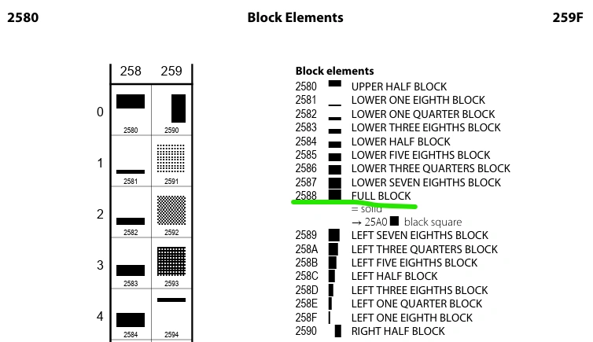</img>

A 100 x 100 sized pixels board with random colored FULL BLOCK character test

</img>

### 2.2 Sprite Design

All sprite designs are created using vector of string with "*" character as follows.

|Game Character | Sprite Design|
|-|-|
|Enemy|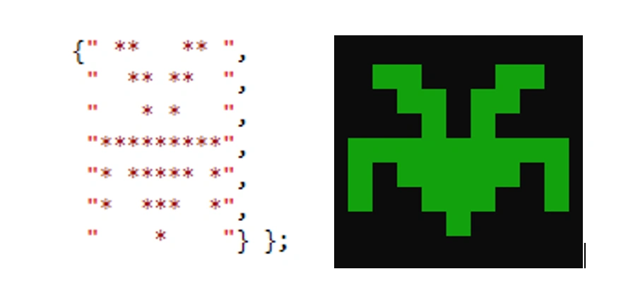</img>|
|Spaceship|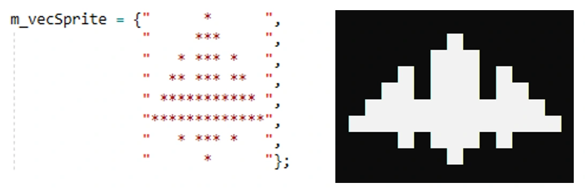</img>|
|Missile|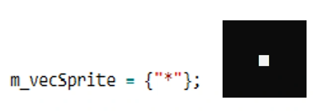</img>|

 

## Section 3 - Prerequisite Settings

Wide-Character is needed as the Character Set since the FULL BLOCK █ character is in UTF-16

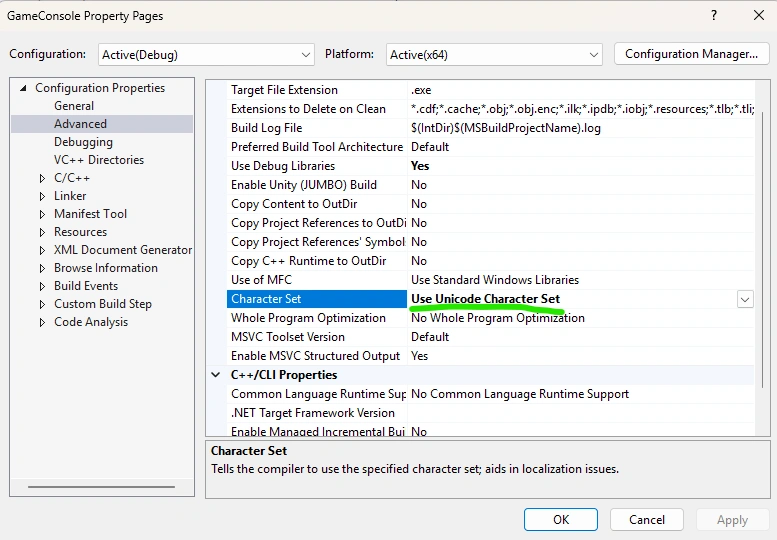</img>

Legacy terminal is needed since Window 11 onwards "Window Terminal" do not support character width modification

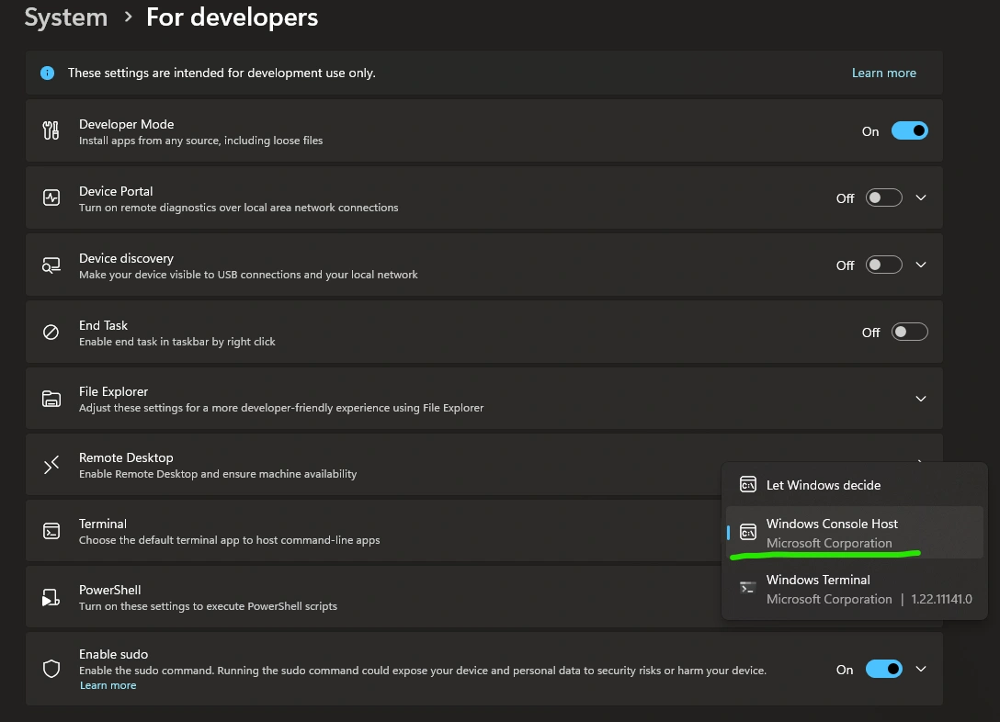</img>

 

## Section 4 - Features and Functionalities

|Item|Features, Functionalities|
|-|-|
|1|Game uses one thread resource|
|2|Game runs with at least sleep(1) loop interval|
|3|Spaceship, enemy and missile have modifiable individual response and sampling control rate|
|4|Player can use UP, DOWN, LEFT and RIGHT arrow key to control spaceship freely within the console area|
|5|Player can use "S" key to fire missile|
|6|Enemies are created and owned by the Enemy Factory in which being spawn at the random top edge of the gaming board in a random intervals|
|7|Enemies move with a left-right random zigzag steps during downward motion|
|8|All game objects are bounded with its pre-defined boundary during instantiation|
|9|A 3 frame destroy anime is used when enemy or spaceship being destroyed|

 

## Section 5 - Project UML Diagram

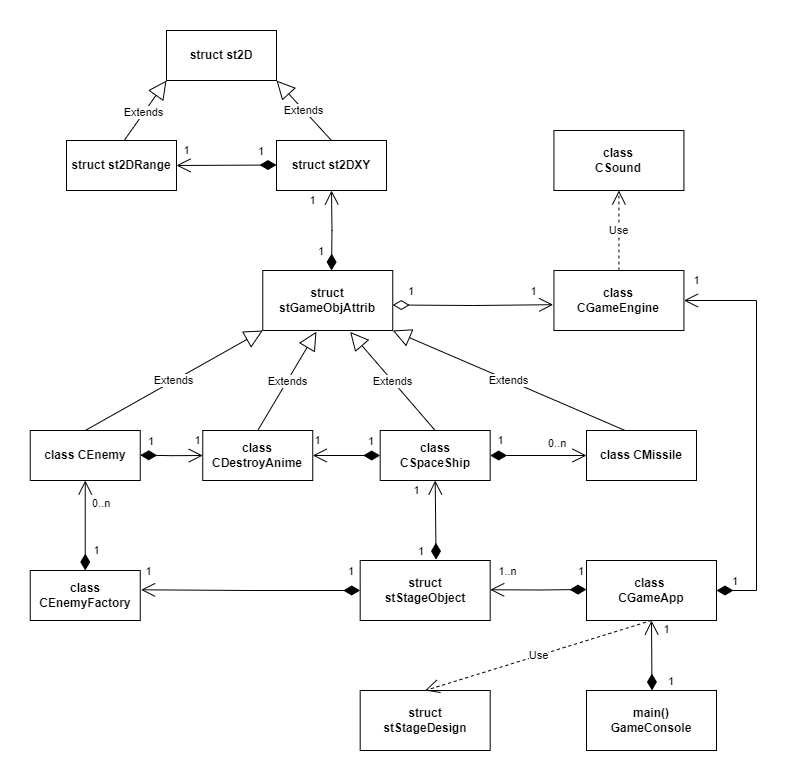</img>

 

## Section 6 - FlowChart

## 6.1 Programming Flow

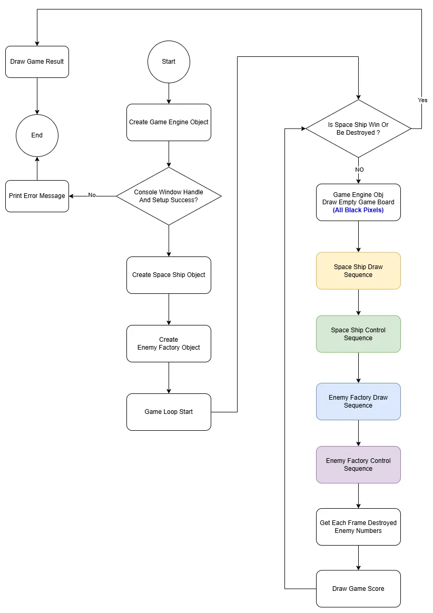</img>

 

## 6.2 Spaceship Flow

### 6.2.1 Rendering Flow

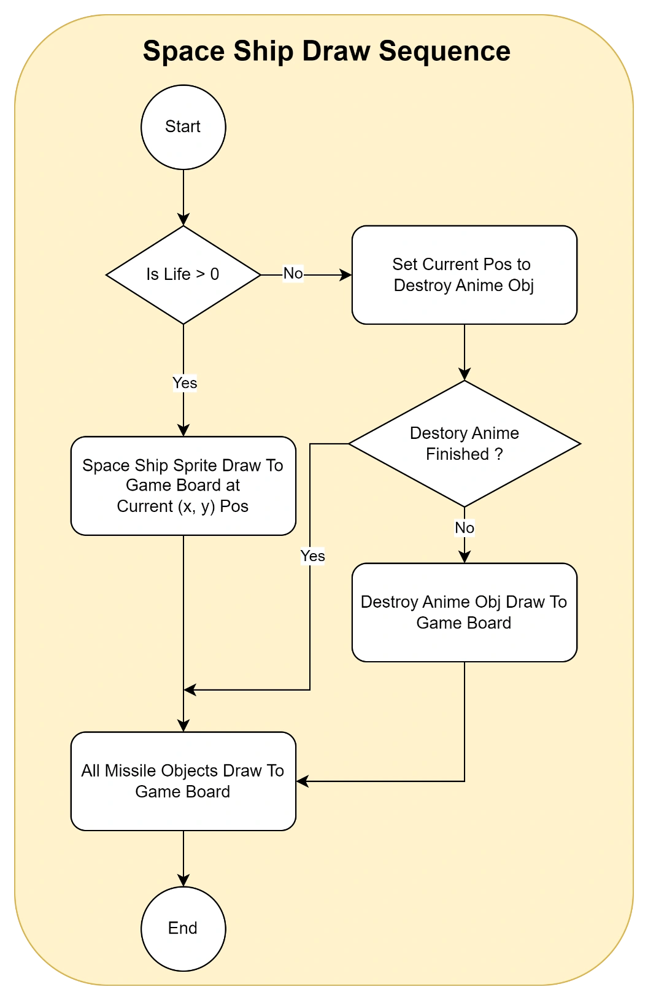</img>

### 6.2.2 Control Flow

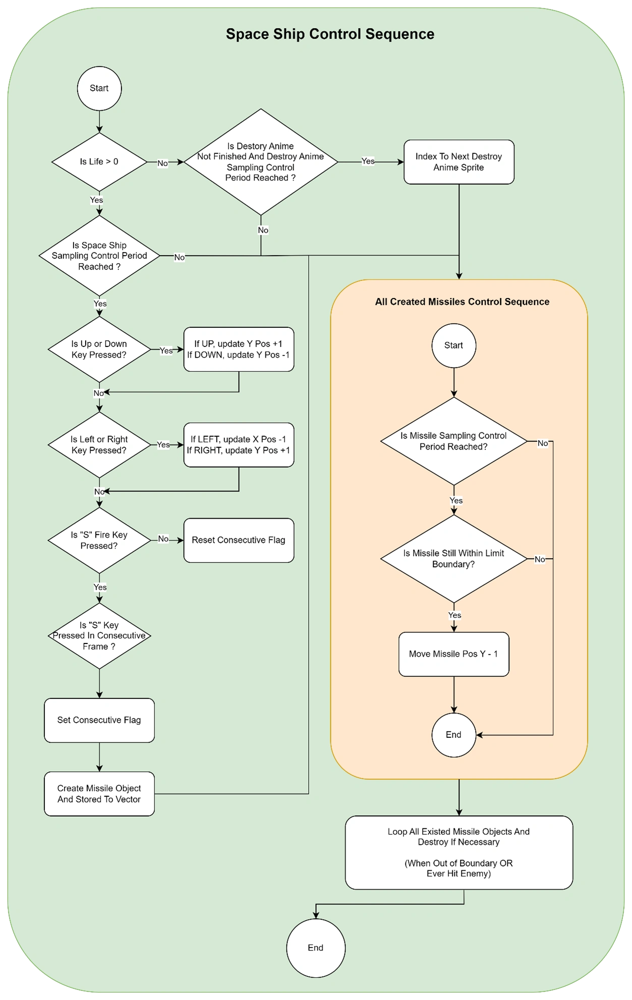</img>

 

## 6.3 Enemy Factory and Enemy Flow

### 6.3.1 Rendering Flow

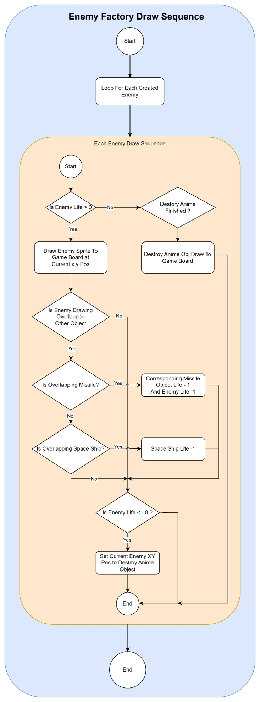</img>

### 6.2.2 Control Flow

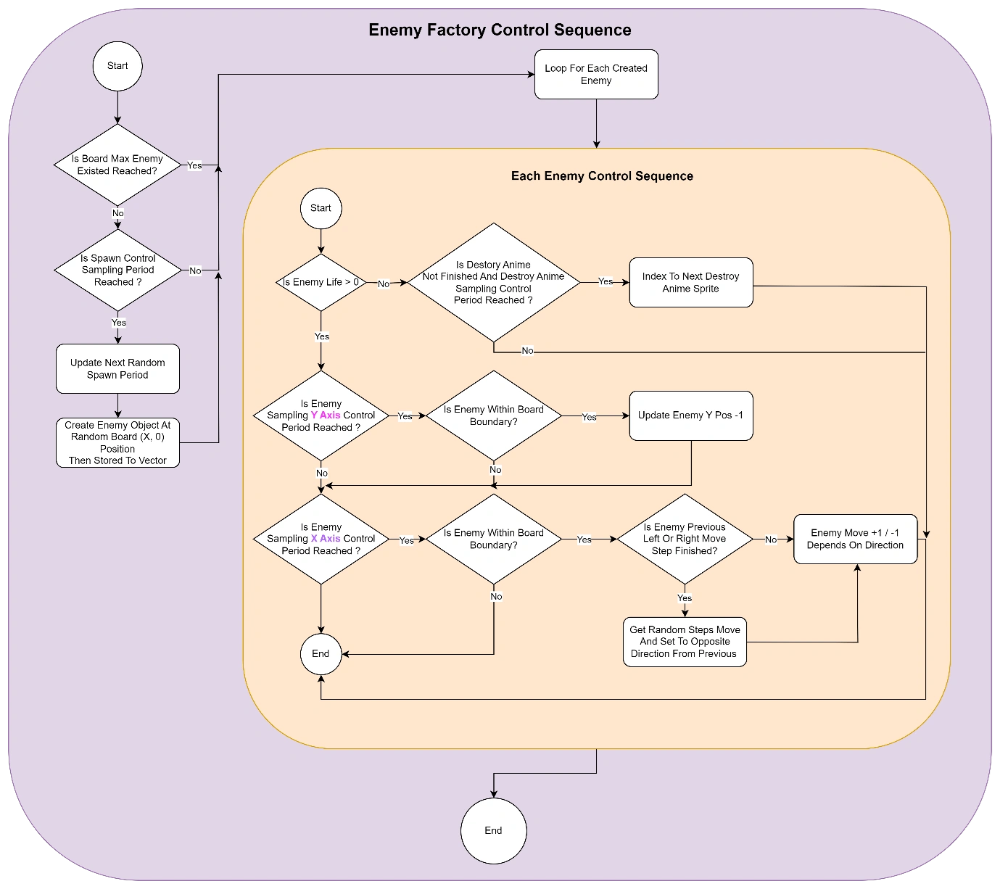</img>

 

END of Document